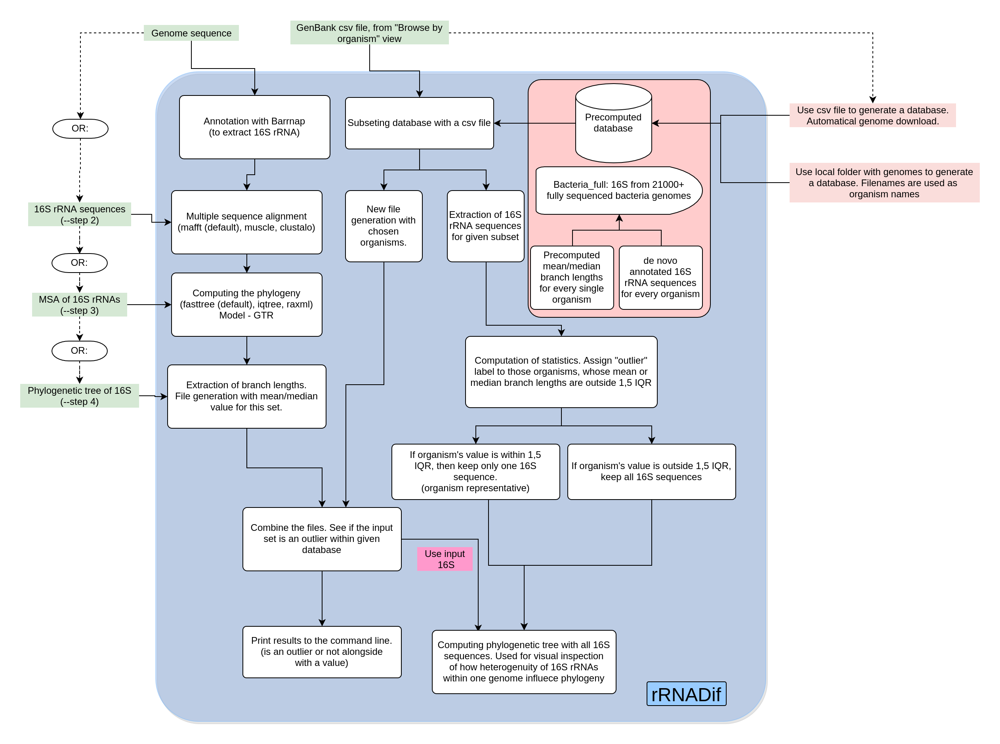

# Introduction

rRNADif is a method to measure intragenomic 16S rRNA variability within the desired genome sequence against a chosen set of organisms. The app is calculating ML phylogenetic tree and uses mean/median branch length within set of 16S rRNA as a measure of variability between them  
By default precomputed database of 21000+ fully sequenced bacterial genomes is available for comparison. However, custom database generation is possible (see [documentation](https://ostash-group.github.io/rRNADif/)) 
If you want to contribute, please feel free to do so !(:  
**Documentation and user guides are available in the [website](https://ostash-group.github.io/rRNADif/)**
# Analysis Pipeline

# Citation
This is work in progress, so no publication is available at the moment. If you found this approach valuable, you can site this repo:  
P. Hrab & B. Ostash 2020: rRNADif, GitHub repository: https://github.com/pavlohrab/rRNADif

The latest doi is 
